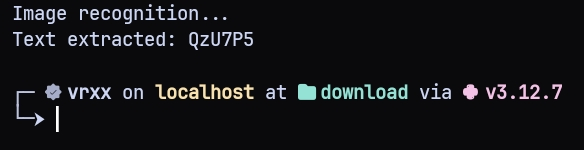

## Requirements
```bash
pip install requests
```


## Example Code
```py
from ocr_solver import OCRSolver

# Extract from file path.
image = OCRSolver(image_path="./captcha.png")
print(image.extract())


# Extract from base64 image.
image_b64 = OCRSolver(image_base64="iVBORw0KGgoAAAANSUhEUgAAAKAAAAAyCAIAAABUA0cyAAAFi0lEQVR4Xu2YUZLiMAxEue7...")
print(image_b64.extract())
```



